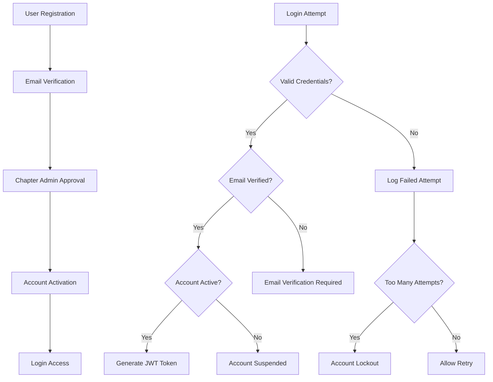

# 🔐 Threat Combat - Enhanced Authentication System

## Overview

This document outlines the comprehensive authentication and security system implemented for the Threat Combat platform, featuring hierarchical role-based access control, email verification, password reset, audit logging, and advanced security measures.

## 🏗️ Architecture

### Hierarchical Role System

```
┌─────────────────────────────────────────────────────────────┐
│                    THREAT COMBAT HQ                        │
│                     (Super Admin)                          │
└─────────────────────────────────────────────────────────────┘
                              │
                              ▼
┌─────────────────────────────────────────────────────────────┐
│                    UNIVERSITY CHAPTERS                      │
│                  (Chapter Admins)                          │
└─────────────────────────────────────────────────────────────┘
                              │
                              ▼
┌─────────────────────────────────────────────────────────────┐
│                  CHAPTER EXECUTIVES                         │
│              (Presidents, Secretaries, etc.)               │
└─────────────────────────────────────────────────────────────┘
                              │
                              ▼
┌─────────────────────────────────────────────────────────────┐
│                    CHAPTER MEMBERS                          │
│                 (Students & Professionals)                  │
└─────────────────────────────────────────────────────────────┘
                              │
                              ▼
┌─────────────────────────────────────────────────────────────┐
│                  INDUSTRY PARTNERS                          │
│              (Cross-chapter collaboration)                 │
└─────────────────────────────────────────────────────────────┘
```

## 👥 User Roles & Permissions

### 1. Super Admin (Threat Combat HQ)
- **Full system access**
- **Manage all university chapters**
- **Global analytics and reporting**
- **Industry partnerships and connections**
- **Global events and competitions**

### 2. Chapter Admin (University Level)
- **Manage their specific university chapter**
- **Student enrollment and onboarding**
- **Chapter-specific activities**
- **Local events and workshops**
- **Chapter analytics**

### 3. Executives (Chapter Level)
- **President, Vice President, Secretary, Treasurer**
- **Technical Lead, Research Coordinator**
- **Manage chapter activities and events**
- **Coordinate with other chapters**

### 4. Members (Students/Professionals)
- **Access to their chapter activities**
- **Cross-chapter collaboration**
- **Industry connections**
- **Training and certifications**

### 5. Industry Partners
- **Special role for industry professionals**
- **Access to global features**
- **Collaborate with all chapters**
- **Mentorship and training opportunities**

## 🔒 Security Features

### Authentication Flow



### Security Measures

#### 1. Rate Limiting
- **Authentication endpoints**: 5 attempts per 15 minutes
- **Password reset**: 3 attempts per hour
- **Registration**: 10 attempts per hour
- **General API**: 100 requests per 15 minutes

#### 2. Account Security
- **Email verification required**
- **Account lockout after 5 failed attempts**
- **Password complexity requirements**
- **Session management with JWT**

#### 3. Input Validation & Sanitization
- **MongoDB injection prevention**
- **XSS protection**
- **SQL injection prevention**
- **Input sanitization**

#### 4. Audit Logging
- **All user actions logged**
- **Security events tracked**
- **Suspicious activity detection**
- **Compliance reporting**

## 📧 Email System

### Email Templates

#### 1. Email Verification
- **Welcome message**
- **Verification link**
- **24-hour expiration**

#### 2. Password Reset
- **Reset link**
- **1-hour expiration**
- **Security warnings**

#### 3. Account Notifications
- **Account activation**
- **Account suspension**
- **Role changes**

#### 4. Welcome Email
- **Platform introduction**
- **Next steps guide**
- **Chapter information**

## 🔍 Audit Logging

### Tracked Actions

#### Authentication
- Login attempts (success/failure)
- Logout events
- Password changes
- Password reset requests

#### User Management
- User creation
- User updates
- Role changes
- Account activation/suspension

#### Chapter Management
- Chapter creation
- Chapter updates
- Member promotions/demotions

#### Security Events
- Failed login attempts
- Account lockouts
- Suspicious activity
- Rate limit violations

### Audit Log Fields

```javascript
{
  userId: ObjectId,
  userRole: String,
  userChapter: ObjectId,
  action: String,
  resource: String,
  resourceId: ObjectId,
  details: Object,
  ipAddress: String,
  userAgent: String,
  method: String,
  url: String,
  statusCode: Number,
  success: Boolean,
  errorMessage: String,
  duration: Number,
  riskLevel: String,
  requiresReview: Boolean
}
```

## 🚀 API Endpoints

### Authentication Endpoints

#### Registration
```http
POST /api/auth/register
POST /api/auth/register/industry
```

#### Authentication
```http
POST /api/auth/login
POST /api/auth/logout
GET /api/auth/profile
```

#### Password Management
```http
POST /api/auth/change-password
POST /api/auth/forgot-password
POST /api/auth/reset-password
```

#### Email Verification
```http
GET /api/auth/verify-email/:token
```

### User Management Endpoints

#### User Operations
```http
GET /api/users
GET /api/users/:id
PUT /api/users/:id
DELETE /api/users/:id
```

#### Role Management
```http
POST /api/users/:id/promote
POST /api/users/:id/demote
```

#### Membership Management
```http
POST /api/users/:id/activate
POST /api/users/:id/suspend
```

#### Analytics
```http
GET /api/users/stats
GET /api/users/chapter/:chapterId
```

## 🔧 Environment Configuration

### Required Environment Variables

```bash
# Server
NODE_ENV=development
PORT=5000
FRONTEND_URL=http://localhost:3000

# Database
MONGODB_URI=mongodb://localhost:27017/threat-combat

# JWT
JWT_SECRET=your-super-secret-jwt-key
JWT_EXPIRES_IN=7d

# Email
EMAIL_HOST=smtp.gmail.com
EMAIL_PORT=587
EMAIL_USER=your-email@gmail.com
EMAIL_PASS=your-app-password

# Security
BCRYPT_ROUNDS=12
MAX_LOGIN_ATTEMPTS=5
ACCOUNT_LOCKOUT_DURATION=3600000
```

## 🛡️ Security Best Practices

### 1. Password Security
- **Minimum 8 characters**
- **Must include uppercase, lowercase, number, symbol**
- **Bcrypt hashing with 12 rounds**
- **Password history tracking**

### 2. Session Security
- **JWT tokens with 7-day expiration**
- **Secure HTTP-only cookies**
- **CSRF protection**
- **Session invalidation on logout**

### 3. API Security
- **Rate limiting on all endpoints**
- **Input validation and sanitization**
- **CORS configuration**
- **Security headers (Helmet)**

### 4. Data Protection
- **Sensitive data encryption**
- **Audit trail for all changes**
- **Data retention policies**
- **GDPR compliance features**

## 📊 Monitoring & Analytics

### Security Monitoring
- **Failed login attempts**
- **Suspicious IP addresses**
- **Unusual activity patterns**
- **Account lockout events**

### User Analytics
- **Registration trends**
- **Chapter growth metrics**
- **User engagement data**
- **Role distribution**

### System Health
- **API response times**
- **Error rates**
- **Database performance**
- **Email delivery rates**

## 🚨 Incident Response

### Security Incidents
1. **Account compromise detection**
2. **Suspicious activity alerts**
3. **Rate limit violations**
4. **Data breach response**

### Response Procedures
1. **Immediate account suspension**
2. **Audit log analysis**
3. **User notification**
4. **Security review**

## 📋 Compliance

### Data Protection
- **User consent management**
- **Data retention policies**
- **Right to be forgotten**
- **Data portability**

### Audit Requirements
- **Comprehensive logging**
- **Access control reviews**
- **Security assessments**
- **Compliance reporting**

## 🔄 Future Enhancements

### Planned Features
- **Multi-factor authentication (MFA)**
- **OAuth integration (Google, GitHub)**
- **Advanced threat detection**
- **Real-time security alerts**
- **Automated incident response**
- **Advanced analytics dashboard**

### Integration Points
- **Single Sign-On (SSO)**
- **LDAP/Active Directory**
- **SAML/OIDC support**
- **API key management**
- **Webhook notifications**

---

## 📞 Support

For technical support or security concerns:
- **Email**: security@threatcombat.com
- **Documentation**: `/api-docs`
- **Health Check**: `/health`

---

*This authentication system provides enterprise-grade security while maintaining user-friendly experience for the Threat Combat cybersecurity education platform.* 